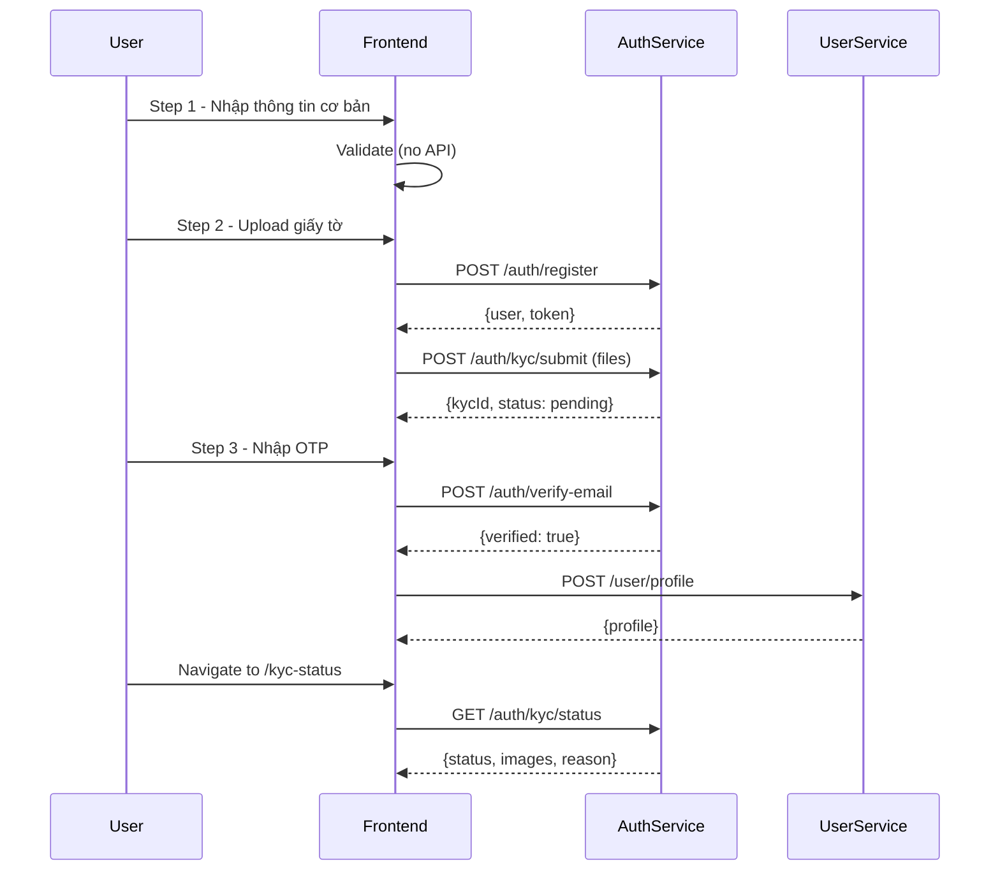

# 🎉 KYC Verification System - Hoàn thành

## ✅ Tổng quan

Đã implement đầy đủ hệ thống **KYC (Know Your Customer) Verification** vào registration flow với các tính năng:

### 1. **Backend đã có sẵn** ✓
- ✅ Models: `KYCVerification` với đầy đủ fields
- ✅ Controllers: `kycController.js` với submit, getStatus, verify, getPending
- ✅ Routes: `/api/v1/auth/kyc/submit`, `/api/v1/auth/kyc/status`
- ✅ File upload middleware với multer
- ✅ Admin routes để duyệt KYC

### 2. **Frontend đã implement** ✓

#### **A. Auth Service (auth.service.js)**
```javascript
// Đã thêm methods:
- submitKYC(kycData) // POST /auth/kyc/submit với multipart/form-data
- getKYCStatus()     // GET /auth/kyc/status
```

#### **B. Register Flow (Register.jsx)**
**4-Step Registration với KYC:**

**Step 1: Thông tin cơ bản**
- Full name, email, phone, date of birth, address
- Password validation với strength meter
- ❌ Không gọi API (chỉ validate)

**Step 2: Giấy tờ tùy thân + KYC Upload** ⭐ NEW
- Gender (lưu trực tiếp vào UserProfile)
- City, emergency contact (lưu vào preferences)
- ID card number, driver license number
- **File uploads:**
  - CCCD/CMND mặt trước *(required)*
  - CCCD/CMND mặt sau *(required)*
  - GPLX *(optional)*
  - Ảnh chân dung *(required)*
- ✅ Gọi `authService.register()` → Tạo User
- ✅ Gọi `authService.submitKYC()` → Upload documents

**Step 3: Email Verification**
- Nhập OTP code
- ✅ Gọi `authService.verifyEmail()` → Verify email
- ✅ Gọi `userService.createProfile()` → Tạo UserProfile

**Step 4: Success**
- Hiển thị thông báo thành công
- Redirect to login

#### **C. KYC Status Page (KYCStatus.jsx)** ⭐ NEW
**Routes:**
- `/kyc-status`
- `/dashboard/coowner/account/kyc`

**Features:**
- ✅ Hiển thị trạng thái KYC: `not_submitted`, `pending`, `approved`, `rejected`
- ✅ Preview ảnh giấy tờ đã upload
- ✅ Hiển thị lý do từ chối (nếu rejected)
- ✅ Form resubmit KYC (nếu rejected hoặc not_submitted)
- ✅ Refresh status button
- ✅ Responsive UI với Tailwind + Framer Motion

### 3. **Database Migration** 
**File:** `backend/user-service/src/migrations/008-add-gender-to-user-profiles.js`

**Action:** Thêm gender column vào `user_profiles` table
```javascript
gender: ENUM('male', 'female', 'other')
```

**⚠️ User cần chạy:**
```bash
cd backend/user-service
npm run migrate
```

---

## 📋 Flow hoàn chỉnh



---

## 🗂 Files đã thay đổi

### **Backend:**
1. ✅ `backend/user-service/src/migrations/008-add-gender-to-user-profiles.js` - Sửa từ ES6 sang CommonJS
2. ✅ Backend KYC đã có sẵn (không cần sửa)

### **Frontend:**
1. ✅ `frontend/src/services/auth.service.js` - Thêm submitKYC() và getKYCStatus()
2. ✅ `frontend/src/pages/auth/Register.jsx`:
   - Thêm kycFiles state
   - Thêm handleFileChange()
   - Thêm file upload UI trong Step 2
   - Gọi submitKYC() sau register
3. ✅ `frontend/src/pages/profile/KYCStatus.jsx` - NEW PAGE
4. ✅ `frontend/src/App.jsx` - Thêm routes cho KYCStatus

---

## 🚀 Testing Checklist

### 1. **Chạy Migration**
```bash
cd backend/user-service
npm run migrate
# Expected: Migration 008-add-gender-to-user-profiles thành công
```

### 2. **Start Services**
```bash
# Terminal 1: Auth Service
cd backend/auth-service
npm run dev

# Terminal 2: User Service  
cd backend/user-service
npm run dev

# Terminal 3: API Gateway
cd backend/api-gateway
npm run dev

# Terminal 4: Frontend
cd frontend
npm run dev
```

### 3. **Test Registration Flow**
1. Navigate to `/register`
2. **Step 1:** Fill basic info → Click "Tiếp tục"
3. **Step 2:** 
   - Fill gender, city, ID card number
   - Upload CCCD front/back *(required)*
   - Upload selfie *(required)*
   - Click "Đăng ký"
   - ✅ Should see toast: "Đăng ký và nộp giấy tờ thành công!"
4. **Step 3:** Enter OTP → Click "Xác thực"
   - ✅ Should create user profile
5. **Step 4:** Success screen → Redirect to login

### 4. **Test KYC Status Page**
1. Login with registered account
2. Navigate to `/kyc-status`
3. ✅ Should see status: "Đang xét duyệt" (pending)
4. ✅ Should see uploaded images
5. ✅ Should see submission time

### 5. **Test Resubmit (Admin rejects KYC)**
1. Admin rejects KYC with reason
2. Navigate to `/kyc-status`
3. ✅ Should see status: "Bị từ chối" (rejected)
4. ✅ Should see rejection reason
5. ✅ Should see resubmit form
6. Upload new documents → Submit
7. ✅ Should see status: "Đang xét duyệt" (pending)

---

## 🎨 UI Features

### **Register Page - Step 2**
- File upload inputs với custom styling
- File name preview khi upload thành công
- Validation: CCCD + selfie required
- Instructions: "Ảnh rõ nét, JPG/PNG, max 5MB"

### **KYC Status Page**
- Status badge với colors:
  - Gray: Not submitted
  - Yellow: Pending
  - Green: Approved
  - Red: Rejected
- Image preview grid (2x2 hoặc 2x4)
- Rejection reason alert box
- Resubmit form (conditional)
- Refresh button
- Info banners

---

## 📊 Database Schema

### **KYC Verification Table**
```sql
kyc_verifications (
  id UUID PRIMARY KEY,
  user_id UUID REFERENCES users(id),
  id_card_number VARCHAR(20) UNIQUE,
  id_card_front_url VARCHAR(500),
  id_card_back_url VARCHAR(500),
  driver_license_number VARCHAR(20),
  driver_license_url VARCHAR(500),
  selfie_url VARCHAR(500), -- NEW (ảnh chân dung)
  verification_status ENUM('pending', 'approved', 'rejected'),
  verified_by UUID REFERENCES users(id),
  verified_at TIMESTAMP,
  rejection_reason TEXT,
  created_at TIMESTAMP,
  updated_at TIMESTAMP
)
```

### **User Profile Table**
```sql
user_profiles (
  id UUID PRIMARY KEY,
  user_id UUID REFERENCES users(id),
  full_name VARCHAR(255),
  date_of_birth DATE,
  gender ENUM('male', 'female', 'other'), -- NEW
  address TEXT,
  avatar_url VARCHAR(500),
  bio TEXT,
  preferences JSONB, -- {city, emergencyContact: {name, phone}}
  created_at TIMESTAMP,
  updated_at TIMESTAMP
)
```

---

## 🔐 Security Notes

1. **File Upload:**
   - Multer middleware handles file validation
   - Max file size: 5MB per file
   - Allowed types: image/* (jpg, png)
   - Files saved to: `backend/auth-service/uploads/kyc/`

2. **Authentication:**
   - All KYC endpoints require JWT token
   - Admin verification requires `admin` or `staff` role
   - Token stored in localStorage after registration

3. **Data Privacy:**
   - ID card numbers are unique
   - Sensitive data stored in separate KYC table
   - File URLs are relative paths (not publicly accessible without auth)

---

## 🐛 Troubleshooting

### **Migration fails:**
```bash
# Check database connection
cd backend/user-service
cat src/config/config.js

# Run migration manually
npx sequelize-cli db:migrate
```

### **File upload fails:**
```bash
# Check uploads directory exists
cd backend/auth-service
mkdir -p uploads/kyc
chmod 755 uploads
```

### **KYC status returns 404:**
- Check if user is authenticated
- Check if token is valid
- Check if auth-service is running on port 3001

### **Images not showing:**
- Check file paths in database
- Check `backend/auth-service/src/app.js` has:
  ```javascript
  app.use('/uploads', express.static(path.join(__dirname, '../uploads')));
  ```

---

## 📝 Next Steps

### **Optional Enhancements:**
1. **Admin KYC Dashboard:**
   - Page để admin xem pending KYCs
   - Approve/Reject với lý do
   - Already implemented in backend: `/admin/kyc`

2. **Email Notifications:**
   - Send email khi KYC được approve/reject
   - RabbitMQ event: `kyc.verified`

3. **Image Compression:**
   - Compress images before upload (frontend)
   - Use Sharp library (backend)

4. **OCR Integration:**
   - Auto-extract ID card number from image
   - Validate ID card format

5. **Face Recognition:**
   - Compare selfie with ID card photo
   - Use AWS Rekognition or similar

---

## 🎯 Summary

✅ **Backend:** KYC đã có sẵn, chỉ cần chạy migration gender  
✅ **Frontend:** Register flow + KYC upload + Status page hoàn tất  
✅ **Testing:** Ready to test sau khi chạy migration  

**User action required:**
```bash
cd backend/user-service
npm run migrate
```

**Then start services and test!** 🚀
