# Activity Diagram - Quy trình Đặt lịch Xe

> Quy trình đặt lịch sử dụng xe với thuật toán ưu tiên và xử lý xung đột

```mermaid
flowchart TD
    Start([Bắt đầu đặt lịch]) --> CheckAuth{Đã đăng nhập<br/>& KYC approved?}
    CheckAuth -->|Không| ShowAuthError[Yêu cầu<br/>đăng nhập & KYC]
    ShowAuthError --> End1([Kết thúc])
    
    CheckAuth -->|Có| SelectGroup{Thuộc nhóm<br/>nào?}
    SelectGroup --> LoadGroupVehicles[Tải danh sách xe<br/>của nhóm]
    
    LoadGroupVehicles --> SelectVehicle[Chọn xe]
    SelectVehicle --> ViewCalendar[Xem lịch xe:<br/>- Slot trống<br/>- Slot đã đặt<br/>- Ngày bảo dưỡng]
    
    ViewCalendar --> SelectDateTime[Chọn ngày giờ:<br/>Bắt đầu + Kết thúc]
    SelectDateTime --> InputDetails[Nhập chi tiết:<br/>- Mục đích<br/>- Điểm đến<br/>- Km dự kiến]
    
    InputDetails --> ValidateInput{Thông tin<br/>hợp lệ?}
    ValidateInput -->|Không| ShowError1[Hiển thị lỗi:<br/>Thời gian không hợp lệ]
    ShowError1 --> SelectDateTime
    
    ValidateInput -->|Có| CheckConflict{Có xung đột<br/>với lịch khác?}
    
    CheckConflict -->|Có xung đột| DetectConflictType{Loại<br/>xung đột?}
    
    DetectConflictType --> FullOverlap[Trùng hoàn toàn:<br/>Không thể đặt]
    FullOverlap --> ShowConflict1[Hiển thị:<br/>Slot đã được đặt<br/>Gợi ý slot khác]
    ShowConflict1 --> ViewCalendar
    
    DetectConflictType --> PartialOverlap[Trùng một phần:<br/>Có thể thương lượng]
    PartialOverlap --> ShowConflict2[Hiển thị xung đột<br/>với lịch khác]
    ShowConflict2 --> UserChoice1{Chọn<br/>hành động?}
    
    UserChoice1 -->|Hủy| End2([Kết thúc])
    UserChoice1 -->|Chọn slot khác| ViewCalendar
    UserChoice1 -->|Gửi yêu cầu协商| CreateConflictRequest[Tạo yêu cầu<br/>thương lượng]
    CreateConflictRequest --> NotifyOtherUser[Thông báo<br/>người dùng kia]
    NotifyOtherUser --> WaitResponse[Chờ phản hồi<br/>48h]
    WaitResponse --> End3([Xử lý sau])
    
    CheckConflict -->|Không xung đột| CalculatePriority[Tính điểm ưu tiên:<br/>- Tỷ lệ sở hữu<br/>- Lịch sử sử dụng<br/>- Thời gian đặt trước]
    
    CalculatePriority --> CheckAutoConfirm{Điểm ưu tiên<br/>> ngưỡng?}
    
    CheckAutoConfirm -->|Có| AutoConfirm[Tự động xác nhận<br/>Status: confirmed<br/>auto_confirmed = true]
    AutoConfirm --> GenerateQR[Tạo mã QR<br/>check-in/check-out]
    GenerateQR --> SendConfirmNotif[Gửi thông báo:<br/>- Email<br/>- Push notification]
    SendConfirmNotif --> ShowSuccess1[Hiển thị:<br/>Đặt lịch thành công<br/>Đã xác nhận]
    ShowSuccess1 --> End4([Kết thúc])
    
    CheckAutoConfirm -->|Không| PendingApproval[Chờ phê duyệt<br/>Status: pending]
    PendingApproval --> NotifyGroupMembers[Thông báo<br/>thành viên nhóm<br/>có yêu cầu mới]
    
    NotifyGroupMembers --> WaitApproval[Chờ 24h<br/>để phản đối]
    
    WaitApproval --> CheckObjection{Có thành viên<br/>phản đối?}
    
    CheckObjection -->|Có| StartVoting[Bắt đầu bỏ phiếu:<br/>48h để quyết định]
    StartVoting --> VoteResult{Kết quả<br/>bỏ phiếu?}
    
    VoteResult -->|Đồng ý >= 60%| ApproveBooking[Phê duyệt lịch đặt<br/>Status: confirmed]
    ApproveBooking --> GenerateQR
    
    VoteResult -->|Từ chối > 40%| RejectBooking[Từ chối lịch đặt<br/>Status: cancelled]
    RejectBooking --> SendRejectNotif[Gửi thông báo<br/>từ chối + lý do]
    SendRejectNotif --> OfferAlternative[Đề xuất<br/>slot khác]
    OfferAlternative --> End5([Kết thúc])
    
    CheckObjection -->|Không| AutoApprove[Tự động phê duyệt<br/>sau 24h]
    AutoApprove --> ApproveBooking
    
    style Start fill:#4CAF50,stroke:#2E7D32,stroke-width:3px,color:#fff
    style End1 fill:#F44336,stroke:#C62828,stroke-width:2px,color:#fff
    style End2 fill:#FF9800,stroke:#E65100,stroke-width:2px,color:#fff
    style End3 fill:#2196F3,stroke:#1565C0,stroke-width:2px,color:#fff
    style End4 fill:#4CAF50,stroke:#2E7D32,stroke-width:3px,color:#fff
    style End5 fill:#FF9800,stroke:#E65100,stroke-width:2px,color:#fff
    style AutoConfirm fill:#4CAF50,stroke:#2E7D32,stroke-width:2px,color:#fff
    style ApproveBooking fill:#4CAF50,stroke:#2E7D32,stroke-width:2px,color:#fff
    style RejectBooking fill:#F44336,stroke:#C62828,stroke-width:2px,color:#fff
```

## Ghi chú

### Điều kiện tiên quyết:
1. Người dùng đã đăng nhập
2. KYC đã được phê duyệt (is_verified = true)
3. Là thành viên của nhóm đồng sở hữu

### Quy trình chính:

#### 1. Chọn xe và thời gian
- Xem lịch của xe (trống/đã đặt/bảo dưỡng)
- Chọn thời gian bắt đầu & kết thúc
- Nhập mục đích, điểm đến, km dự kiến

#### 2. Kiểm tra xung đột
**Xung đột hoàn toàn**: Không thể đặt → Gợi ý slot khác
**Xung đột một phần**: 
- Hiển thị thông tin xung đột
- Tùy chọn: Chọn slot khác hoặc Gửi yêu cầu thương lượng
- Người được đặt trước có 48h để phản hồi

#### 3. Tính điểm ưu tiên
Hệ thống tính toán dựa trên:
- **Tỷ lệ sở hữu** (40%): Người sở hữu nhiều hơn → Ưu tiên cao hơn
- **Lịch sử sử dụng** (30%): Sử dụng ít hơn mức sở hữu → Ưu tiên cao hơn
- **Thời gian đặt trước** (20%): Đặt sớm → Ưu tiên cao hơn
- **Tần suất hủy lịch** (10%): Hủy ít → Ưu tiên cao hơn

#### 4. Xác nhận booking

**A. Tự động xác nhận** (điểm ưu tiên cao):
- Xác nhận ngay lập tức
- Tạo mã QR cho check-in/check-out
- Gửi thông báo xác nhận

**B. Chờ phê duyệt** (điểm ưu tiên thấp):
- Status = `pending`
- Thông báo thành viên nhóm
- Chờ 24h để phản đối

**Nếu có phản đối**:
- Bắt đầu bỏ phiếu (48h)
- Tính theo tỷ lệ sở hữu
- Cần >= 60% đồng ý để phê duyệt

**Nếu không phản đối**:
- Tự động phê duyệt sau 24h

### Trạng thái Booking:
- `pending`: Chờ phê duyệt
- `confirmed`: Đã xác nhận (sẵn sàng sử dụng)
- `in_progress`: Đang sử dụng (sau check-in)
- `completed`: Hoàn thành (sau check-out)
- `cancelled`: Đã hủy
- `conflict`: Có xung đột chưa giải quyết

### Thời gian:
- Thương lượng xung đột: 48h
- Chờ phản đối: 24h
- Bỏ phiếu: 48h
