# Activity Diagram - Check-in/Check-out với QR

> Quy trình check-in và check-out xe sử dụng mã QR và ghi nhận tình trạng xe

```mermaid
flowchart TD
    Start([Đến thời gian<br/>sử dụng xe]) --> HasBooking{Có lịch đặt<br/>đã confirmed?}
    HasBooking -->|Không| ShowError1[Lỗi: Không có<br/>lịch đặt hợp lệ]
    ShowError1 --> End1([Kết thúc])
    
    HasBooking -->|Có| CheckTime{Trong khoảng<br/>thời gian cho phép?}
    CheckTime -->|Không| ShowError2[Lỗi: Chưa đến giờ<br/>hoặc đã quá giờ]
    ShowError2 --> ContactSupport{Liên hệ<br/>Staff?}
    ContactSupport -->|Có| ManualOverride[Staff xử lý<br/>thủ công]
    ManualOverride --> StartCheckIn
    ContactSupport -->|Không| End2([Kết thúc])
    
    CheckTime -->|Có<br/>-15 phút → +30 phút| StartCheckIn[Bắt đầu Check-in]
    
    StartCheckIn --> ScanQRCheckIn[Quét mã QR<br/>trên xe]
    ScanQRCheckIn --> ValidateQR{QR code<br/>hợp lệ?}
    
    ValidateQR -->|Không| ShowQRError[Lỗi: QR không hợp lệ<br/>hoặc sai xe]
    ShowQRError --> RetryQR{Thử lại?}
    RetryQR -->|Có| ScanQRCheckIn
    RetryQR -->|Không| ContactStaff1[Liên hệ Staff<br/>hỗ trợ]
    ContactStaff1 --> End3([Kết thúc])
    
    ValidateQR -->|Có| RecordOdometer[Ghi nhận số km<br/>hiện tại]
    RecordOdometer --> CheckBattery[Kiểm tra mức pin<br/>hiện tại]
    CheckBattery --> TakePhotoBefore[Chụp ảnh xe:<br/>- 4 góc xe<br/>- Nội thất<br/>- Dashboard]
    
    TakePhotoBefore --> InspectCondition[Kiểm tra tình trạng xe]
    InspectCondition --> ConditionIssue{Phát hiện<br/>vấn đề?}
    
    ConditionIssue -->|Có| ReportIssue[Báo cáo vấn đề:<br/>- Mô tả<br/>- Chụp ảnh chi tiết<br/>- Đánh dấu vị trí]
    ReportIssue --> NotifyStaff[Thông báo Staff<br/>& thành viên nhóm]
    NotifyStaff --> WaitStaffCheck{Staff<br/>xác nhận?}
    
    WaitStaffCheck -->|Vấn đề nghiêm trọng| CancelBooking[Hủy booking<br/>Chuyển xe bảo dưỡng]
    CancelBooking --> End4([Kết thúc])
    
    WaitStaffCheck -->|Có thể sử dụng| NoteExisting[Ghi nhận<br/>vấn đề có sẵn]
    NoteExisting --> ConfirmCheckIn
    
    ConditionIssue -->|Không| ConfirmCheckIn[Xác nhận Check-in]
    
    ConfirmCheckIn --> UpdateBookingStatus[Cập nhật:<br/>Status = in_progress<br/>check_in_time = now]
    UpdateBookingStatus --> SaveCheckInLog[Lưu CheckInOutLog:<br/>- Thời gian<br/>- Số km<br/>- Mức pin<br/>- Ảnh<br/>- Ghi chú]
    
    SaveCheckInLog --> UpdateVehicleStatus[Cập nhật xe:<br/>Status = in_use]
    UpdateVehicleStatus --> SendCheckInNotif[Gửi thông báo<br/>check-in thành công]
    SendCheckInNotif --> UseVehicle[Người dùng<br/>sử dụng xe]
    
    UseVehicle --> ReturnVehicle[Trả xe]
    
    ReturnVehicle --> StartCheckOut[Bắt đầu Check-out]
    StartCheckOut --> ScanQRCheckOut[Quét mã QR<br/>check-out]
    
    ScanQRCheckOut --> ValidateQROut{QR hợp lệ<br/>& đúng booking?}
    ValidateQROut -->|Không| ShowQRError2[Lỗi QR]
    ShowQRError2 --> ScanQRCheckOut
    
    ValidateQROut -->|Có| RecordOdometerOut[Ghi nhận số km<br/>cuối cùng]
    RecordOdometerOut --> CalculateDistance[Tính quãng đường:<br/>km_cuối - km_đầu]
    CalculateDistance --> CheckBatteryOut[Kiểm tra mức pin<br/>còn lại]
    CheckBatteryOut --> CalculateEnergy[Tính điện năng<br/>tiêu thụ]
    
    CalculateEnergy --> TakePhotoAfter[Chụp ảnh xe<br/>sau sử dụng:<br/>- 4 góc<br/>- Nội thất<br/>- Dashboard]
    
    TakePhotoAfter --> InspectDamage[Kiểm tra<br/>hư hỏng mới]
    InspectDamage --> NewDamage{Có hư hỏng<br/>mới?}
    
    NewDamage -->|Có| ReportDamage[Báo cáo hư hỏng:<br/>- Mô tả chi tiết<br/>- Chụp ảnh<br/>- Vị trí]
    ReportDamage --> AssignResponsibility[Hệ thống so sánh<br/>ảnh trước/sau]
    AssignResponsibility --> NotifyDamage[Thông báo Staff<br/>& chủ sở hữu]
    NotifyDamage --> CreateDispute{Tranh chấp<br/>trách nhiệm?}
    CreateDispute -->|Có| OpenDisputeCase[Mở case<br/>tranh chấp]
    OpenDisputeCase --> ConfirmCheckOut
    CreateDispute -->|Không| AcceptResponsibility[Người dùng<br/>chấp nhận]
    AcceptResponsibility --> EstimateCost[Ước tính<br/>chi phí sửa chữa]
    EstimateCost --> ConfirmCheckOut
    
    NewDamage -->|Không| ConfirmCheckOut[Xác nhận Check-out]
    
    ConfirmCheckOut --> UpdateBookingComplete[Cập nhật Booking:<br/>Status = completed<br/>check_out_time = now<br/>actual_distance<br/>energy_used]
    
    UpdateBookingComplete --> SaveCheckOutLog[Lưu CheckInOutLog<br/>check-out]
    SaveCheckOutLog --> CalculateCost[Tính toán chi phí:<br/>- Điện năng<br/>- Quãng đường<br/>- Phí dịch vụ]
    
    CalculateCost --> UpdateVehicleAvailable[Cập nhật xe:<br/>Status = available<br/>current_odometer]
    UpdateVehicleAvailable --> CreateCostRecord[Tạo bản ghi<br/>chi phí sử dụng]
    
    CreateCostRecord --> TriggerCostSplit[Kích hoạt<br/>chia sẻ chi phí]
    TriggerCostSplit --> SendCheckOutNotif[Gửi thông báo<br/>check-out thành công<br/>& chi phí]
    
    SendCheckOutNotif --> RateExperience[Đánh giá<br/>trải nghiệm sử dụng]
    RateExperience --> End5([Kết thúc])
    
    style Start fill:#4CAF50,stroke:#2E7D32,stroke-width:3px,color:#fff
    style End1 fill:#F44336,stroke:#C62828,stroke-width:2px,color:#fff
    style End2 fill:#FF9800,stroke:#E65100,stroke-width:2px,color:#fff
    style End3 fill:#FF9800,stroke:#E65100,stroke-width:2px,color:#fff
    style End4 fill:#F44336,stroke:#C62828,stroke-width:2px,color:#fff
    style End5 fill:#4CAF50,stroke:#2E7D32,stroke-width:3px,color:#fff
    style ConfirmCheckIn fill:#4CAF50,stroke:#2E7D32,stroke-width:2px,color:#fff
    style ConfirmCheckOut fill:#4CAF50,stroke:#2E7D32,stroke-width:2px,color:#fff
    style UseVehicle fill:#2196F3,stroke:#1565C0,stroke-width:2px,color:#fff
```

## Ghi chú

### Check-in Process:

#### 1. Xác thực
- Kiểm tra có booking đã confirmed
- Thời gian cho phép: -15 phút đến +30 phút từ thời gian bắt đầu
- Quét mã QR trên xe (mỗi xe có QR riêng)

#### 2. Ghi nhận trạng thái ban đầu
- **Số km**: Ghi lại odometer hiện tại
- **Mức pin**: % pin còn lại
- **Chụp ảnh**:
  - 4 góc xe (trước, sau, 2 bên)
  - Nội thất (ghế, vô lăng, console)
  - Dashboard (hiển thị km, pin, cảnh báo)

#### 3. Kiểm tra tình trạng xe
- Nếu phát hiện vấn đề:
  - Báo cáo chi tiết + ảnh
  - Thông báo Staff
  - Staff xác nhận: Có thể dùng hoặc Hủy booking
- Ghi nhận vào CheckInOutLog

#### 4. Hoàn tất Check-in
- Cập nhật Booking: `status = in_progress`
- Cập nhật Vehicle: `status = in_use`
- Gửi thông báo thành công

### Check-out Process:

#### 1. Quét QR Check-out
- Xác thực booking đang active
- Quét QR trên xe

#### 2. Ghi nhận kết quả sử dụng
- **Số km cuối**: Tính quãng đường = km_cuối - km_đầu
- **Mức pin cuối**: Tính điện năng tiêu thụ
- **Chụp ảnh**: Cùng vị trí như check-in

#### 3. So sánh & Kiểm tra hư hỏng
- Hệ thống so sánh ảnh trước/sau
- AI phát hiện hư hỏng mới (nếu có)
- Nếu có hư hỏng:
  - Báo cáo chi tiết
  - Thông báo Staff & nhóm
  - Mở tranh chấp nếu cần
  - Ước tính chi phí sửa chữa

#### 4. Tính toán chi phí
- **Chi phí điện**: (kWh tiêu thụ) × (giá điện)
- **Chi phí quãng đường**: (km) × (phí/km)
- **Phí dịch vụ**: % trên tổng
- **Chi phí hư hỏng**: Nếu có

#### 5. Hoàn tất Check-out
- Cập nhật Booking: `status = completed`
- Cập nhật Vehicle: `status = available`, `current_odometer`
- Tạo bản ghi chi phí
- Kích hoạt chia sẻ chi phí tự động
- Gửi thông báo + báo cáo chi phí

### Xử lý ngoại lệ:
- **QR không đọc được**: Liên hệ Staff để check-in thủ công
- **Quá giờ**: Staff có thể override
- **Phát hiện vấn đề nghiêm trọng**: Hủy booking, chuyển xe bảo dưỡng
- **Tranh chấp hư hỏng**: Mở case dispute, Staff điều tra

### Dữ liệu lưu trữ:
- **CheckInOutLog**: Thời gian, km, pin, ảnh, ghi chú, người thực hiện
- **Booking**: Status, actual_distance, energy_used, cost
- **Vehicle**: Status, current_odometer
- **Cost**: Chi phí sử dụng lần này
