# Activity Diagram - Thanh toán & Chia sẻ Chi phí

> Quy trình tự động chia sẻ chi phí và thanh toán

```mermaid
flowchart TD
    Start([Chi phí phát sinh]) --> IdentifyCost{Loại<br/>chi phí?}
    
    IdentifyCost -->|Sử dụng xe| UsageCost[Chi phí sử dụng:<br/>- Điện năng<br/>- Km<br/>- Phí dịch vụ]
    IdentifyCost -->|Bảo dưỡng| MaintenanceCost[Chi phí bảo dưỡng:<br/>- Sửa chữa<br/>- Thay phụ tùng<br/>- Kiểm định]
    IdentifyCost -->|Bảo hiểm| InsuranceCost[Chi phí bảo hiểm:<br/>- Phí hàng năm<br/>- Gia hạn]
    IdentifyCost -->|Sạc điện| ChargingCost[Chi phí sạc:<br/>- Từ phiên sạc]
    IdentifyCost -->|Khác| OtherCost[Chi phí khác:<br/>- Phạt nguội<br/>- Rửa xe<br/>- Phí gửi xe]
    
    UsageCost --> CreateCostRecord[Tạo bản ghi Cost]
    MaintenanceCost --> CreateCostRecord
    InsuranceCost --> CreateCostRecord
    ChargingCost --> CreateCostRecord
    OtherCost --> CreateCostRecord
    
    CreateCostRecord --> SelectCategory[Chọn danh mục<br/>chi phí]
    SelectCategory --> InputAmount[Nhập tổng số tiền<br/>& mô tả]
    InputAmount --> UploadInvoice{Có hóa đơn?}
    
    UploadInvoice -->|Có| AttachInvoice[Upload ảnh<br/>hóa đơn]
    AttachInvoice --> SelectSplitType
    UploadInvoice -->|Không| SelectSplitType[Chọn phương thức<br/>chia sẻ]
    
    SelectSplitType --> SplitChoice{Phương thức?}
    
    SplitChoice -->|Theo tỷ lệ sở hữu| OwnershipSplit[Chia theo ownership_ratio]
    SplitChoice -->|Theo mức sử dụng| UsageSplit[Chia theo usage_based]
    SplitChoice -->|Chia đều| EqualSplit[Chia đều cho tất cả]
    SplitChoice -->|Tùy chỉnh| CustomSplit[Tùy chỉnh % cho từng người]
    
    OwnershipSplit --> GetMembers[Lấy danh sách<br/>thành viên nhóm]
    UsageSplit --> GetMembers
    EqualSplit --> GetMembers
    CustomSplit --> InputCustomRatio[Nhập % cho<br/>từng thành viên]
    InputCustomRatio --> ValidateRatio{Tổng = 100%?}
    ValidateRatio -->|Không| ShowError[Lỗi: Tổng % phải = 100%]
    ShowError --> InputCustomRatio
    ValidateRatio -->|Có| GetMembers
    
    GetMembers --> CalculateSplit[Tính toán chi phí<br/>cho từng người]
    
    CalculateSplit --> OwnershipCalc{Loại chia?}
    OwnershipCalc -->|ownership_ratio| CalcByOwnership[Mỗi người = <br/>TotalAmount × ownership%]
    OwnershipCalc -->|usage_based| CalcByUsage[Mỗi người = <br/>TotalAmount × <br/>usage_in_period / total_usage]
    OwnershipCalc -->|equal| CalcEqual[Mỗi người = <br/>TotalAmount / số_thành_viên]
    OwnershipCalc -->|custom| CalcCustom[Mỗi người = <br/>TotalAmount × custom%]
    
    CalcByOwnership --> CreateSplitRecords[Tạo CostSplit<br/>cho từng thành viên]
    CalcByUsage --> CreateSplitRecords
    CalcEqual --> CreateSplitRecords
    CalcCustom --> CreateSplitRecords
    
    CreateSplitRecords --> NotifyMembers[Gửi thông báo<br/>cho tất cả thành viên:<br/>Chi phí mới + Số tiền phải trả]
    
    NotifyMembers --> CheckGroupFund{Sử dụng<br/>quỹ chung?}
    
    CheckGroupFund -->|Có| CheckFundBalance{Quỹ đủ<br/>chi trả?}
    CheckFundBalance -->|Đủ| DeductFromFund[Trừ từ quỹ chung]
    DeductFromFund --> UpdateSplitsAsPaid[Đánh dấu tất cả<br/>CostSplit: paid = true]
    UpdateSplitsAsPaid --> RecordGroupTransaction[Ghi GroupWalletTransaction]
    RecordGroupTransaction --> NotifyPaidFromFund[Thông báo:<br/>Đã thanh toán<br/>từ quỹ chung]
    NotifyPaidFromFund --> End1([Kết thúc])
    
    CheckFundBalance -->|Không đủ| PartialFromFund[Trừ một phần<br/>từ quỹ]
    PartialFromFund --> CalculateRemaining[Tính số còn lại<br/>phải trả cá nhân]
    CalculateRemaining --> IndividualPayment
    
    CheckGroupFund -->|Không| IndividualPayment[Thanh toán cá nhân]
    
    IndividualPayment --> MemberLoop[Với mỗi thành viên]
    MemberLoop --> CheckWallet{Ví cá nhân<br/>đủ tiền?}
    
    CheckWallet -->|Đủ| AutoDeduct[Tự động trừ<br/>từ ví]
    AutoDeduct --> UpdateSplitPaid[Cập nhật CostSplit:<br/>paid = true<br/>paid_at = now]
    UpdateSplitPaid --> RecordWalletTrans[Ghi WalletTransaction]
    RecordWalletTrans --> SendPaymentConfirm[Gửi xác nhận<br/>thanh toán]
    SendPaymentConfirm --> CheckAllPaid{Tất cả<br/>đã trả?}
    
    CheckWallet -->|Không đủ| SendPaymentRequest[Gửi yêu cầu<br/>nạp tiền/thanh toán]
    SendPaymentRequest --> WaitPayment[Chờ người dùng<br/>thanh toán]
    
    WaitPayment --> PaymentMethod{Phương thức<br/>thanh toán?}
    
    PaymentMethod -->|Nạp vào ví| TopUpWallet[Nạp tiền vào ví<br/>qua VNPay/MoMo]
    TopUpWallet --> AutoDeduct
    
    PaymentMethod -->|Thanh toán trực tiếp| DirectPayment[Thanh toán trực tiếp<br/>qua Payment Gateway]
    DirectPayment --> ValidatePayment{Thanh toán<br/>thành công?}
    
    ValidatePayment -->|Thất bại| RetryPayment{Thử lại?}
    RetryPayment -->|Có| PaymentMethod
    RetryPayment -->|Không| MarkOverdue[Đánh dấu:<br/>overdue = true]
    MarkOverdue --> SendReminder[Gửi nhắc nhở<br/>hàng ngày]
    SendReminder --> CheckAllPaid
    
    ValidatePayment -->|Thành công| UpdateSplitPaid
    
    CheckAllPaid -->|Chưa| SendReminder
    CheckAllPaid -->|Rồi| GenerateInvoice[Tạo hóa đơn<br/>Invoice]
    
    GenerateInvoice --> AttachCostSplits[Đính kèm tất cả<br/>CostSplit vào Invoice]
    AttachCostSplits --> UpdateCostInvoiced[Cập nhật Cost:<br/>invoiced = true]
    UpdateCostInvoiced --> SendInvoice[Gửi hóa đơn<br/>cho tất cả thành viên]
    SendInvoice --> UpdateGroupFundBalance[Cập nhật<br/>số dư quỹ chung]
    UpdateGroupFundBalance --> GenerateReport[Tạo báo cáo<br/>chi phí tháng/quý]
    GenerateReport --> End2([Kết thúc])
    
    style Start fill:#4CAF50,stroke:#2E7D32,stroke-width:3px,color:#fff
    style End1 fill:#4CAF50,stroke:#2E7D32,stroke-width:3px,color:#fff
    style End2 fill:#4CAF50,stroke:#2E7D32,stroke-width:3px,color:#fff
    style AutoDeduct fill:#4CAF50,stroke:#2E7D32,stroke-width:2px,color:#fff
    style GenerateInvoice fill:#2196F3,stroke:#1565C0,stroke-width:2px,color:#fff
```



## Ghi chú

### 1. Loại Chi phí

**A. Chi phí Sử dụng** (Tự động):
- Điện năng tiêu thụ
- Quãng đường (km)
- Phí dịch vụ
→ Tự động tạo sau check-out

**B. Chi phí Bảo dưỡng**:
- Sửa chữa định kỳ
- Thay phụ tùng
- Kiểm định
→ Staff ghi nhận sau hoàn thành

**C. Chi phí Bảo hiểm**:
- Phí bảo hiểm hàng năm
- Gia hạn
→ Tự động hoặc thủ công

**D. Chi phí Sạc điện**:
- Ghi nhận từ phiên sạc
→ Tự động hoặc thủ công

**E. Chi phí Khác**:
- Phạt nguội
- Rửa xe
- Phí gửi xe
→ Thủ công

### 2. Phương thức Chia sẻ

**A. Theo tỷ lệ sở hữu** (ownership_ratio):
```
Người A (40%) → Trả 40% chi phí
Người B (35%) → Trả 35% chi phí
Người C (25%) → Trả 25% chi phí
```
→ Áp dụng cho: Bảo hiểm, bảo dưỡng định kỳ

**B. Theo mức sử dụng** (usage_based):
```
Tổng km trong tháng = 1000 km
Người A đi 500 km → Trả 50%
Người B đi 300 km → Trả 30%
Người C đi 200 km → Trả 20%
```
→ Áp dụng cho: Chi phí sử dụng, sạc điện

**C. Chia đều** (equal):
```
Tổng chi phí / Số thành viên
```
→ Áp dụng cho: Phí dịch vụ chung

**D. Tùy chỉnh** (custom):
```
Admin/Chủ nhóm tự định % cho từng người
```
→ Áp dụng cho: Trường hợp đặc biệt

### 3. Thanh toán

**A. Từ Quỹ chung** (Ưu tiên):
- Kiểm tra số dư quỹ
- Nếu đủ → Trừ trực tiếp
- Nếu không đủ → Trừ một phần + Thanh toán cá nhân

**B. Từ Ví cá nhân**:
- Tự động trừ nếu đủ tiền
- Ghi WalletTransaction

**C. Thanh toán trực tiếp**:
- VNPay, MoMo, Banking
- Cập nhật CostSplit sau khi thành công

### 4. Xử lý Quá hạn

**Nếu không thanh toán**:
1. Đánh dấu `overdue = true`
2. Gửi nhắc nhở hàng ngày
3. Sau 7 ngày: Gửi cảnh báo nghiêm trọng
4. Sau 14 ngày: Hạn chế booking
5. Sau 30 ngày: Mở tranh chấp/Đình chỉ

### 5. Hóa đơn (Invoice)

**Sau khi tất cả thanh toán**:
1. Tạo Invoice
2. Đính kèm tất cả CostSplit
3. Gửi cho thành viên
4. Lưu PDF
5. Cập nhật `invoiced = true`

### 6. Báo cáo

**Định kỳ (tháng/quý)**:
- Tổng chi phí nhóm
- Chi phí cá nhân
- So sánh: Mức sử dụng vs Tỷ lệ sở hữu
- Xu hướng chi phí
- Dự đoán chi phí tương lai (AI)

### 7. Thông báo

**Gửi thông báo khi**:
- Chi phí mới phát sinh
- Yêu cầu thanh toán
- Thanh toán thành công
- Quá hạn thanh toán
- Hóa đơn được tạo
- Báo cáo chi phí sẵn sàng
