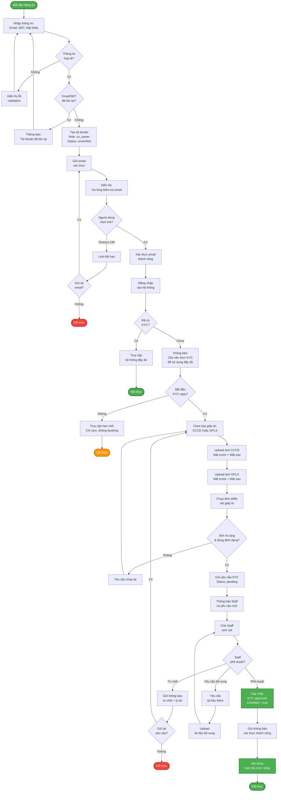

# Activity Diagram - Đăng ký & Xác thực KYC

> Quy trình đăng ký tài khoản và xác thực danh tính

## Ghi chú

### Giai đoạn 1: Đăng ký tài khoản
1. Người dùng nhập email, số điện thoại, mật khẩu
2. Hệ thống validate thông tin
3. Kiểm tra trùng lặp email/SĐT
4. Tạo tài khoản với role = `co_owner`, status = `unverified`
5. Gửi email xác thực (có hiệu lực 24h)

### Giai đoạn 2: Xác thực Email
1. Người dùng click link trong email
2. Hệ thống xác thực token
3. Cập nhật email_verified = true
4. Cho phép đăng nhập

### Giai đoạn 3: Xác thực KYC (Tùy chọn nhưng bắt buộc để booking)
1. **Upload giấy tờ**:
   - CCCD: Mặt trước + Mặt sau
   - GPLX: Mặt trước + Mặt sau (bắt buộc để lái xe)
2. **Chụp Selfie**: Với CCCD/GPLX để xác thực khuôn mặt
3. **Gửi yêu cầu**: Status = `pending`
4. **Staff xem xét**:
   - Phê duyệt → is_verified = true → Mở khóa toàn bộ
   - Từ chối → Gửi lý do → Cho phép gửi lại
   - Yêu cầu bổ sung → Upload thêm tài liệu

### Trạng thái tài khoản:
- **Chưa verify email**: Không thể đăng nhập
- **Đã verify email, chưa KYC**: Chỉ xem thông tin, không đặt lịch
- **Đã KYC approved**: Sử dụng đầy đủ chức năng

### Thời gian xử lý:
- Email verification: 24 giờ
- KYC review: 1-3 ngày làm việc (tùy staff)
