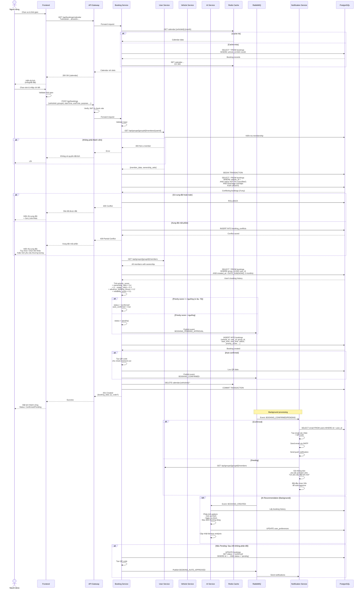

# Sequence Diagram - Đặt lịch Xe

> Quy trình đặt lịch với kiểm tra xung đột và tính toán ưu tiên



## Ghi chú

### Quy trình chính:

#### 1. Xem lịch
- Lấy từ Redis cache (TTL 5 phút)
- Nếu miss → Query DB → Cache lại
- Hiển thị slot trống/đã đặt/bảo dưỡng

#### 2. Tạo booking
1. **Validate**: Thời gian, quyền thành viên
2. **Kiểm tra xung đột**:
   - **Full overlap**: Từ chối ngay
   - **Partial overlap**: Lưu conflict, cho phép thương lượng
   - **No overlap**: Tiếp tục
3. **Tính priority_score**:
   ```
   = ownership_ratio × 40%
   + (1 - usage_ratio) × 30%
   + advance_booking_bonus × 20%
   + reliability_score × 10%
   ```
4. **Quyết định status**:
   - `priority_score >= 70` → `confirmed` (tự động)
   - `priority_score < 70` → `pending` (chờ 24h)

#### 3. Tạo QR code (nếu confirmed)
- QR chứa: `booking_id`, `vehicle_id`, `user_id`, `signature`
- Dùng để check-in/check-out
- Lưu vào DB

#### 4. Thông báo
- **Confirmed**: Gửi email + push cho người đặt
- **Pending**: Gửi cho tất cả thành viên (24h để phản đối)

#### 5. Background tasks
- **AI Service**: Phân tích pattern, cập nhật preferences
- **Auto-approve**: Sau 24h không phản đối → Confirm

### Xử lý xung đột:

**Full Overlap** (A ⊃ B hoặc B ⊃ A):
```
Booking A: 8:00 - 12:00
Booking B: 9:00 - 11:00 ❌ Từ chối
```

**Partial Overlap**:
```
Booking A: 8:00 - 12:00
Booking B: 10:00 - 14:00 ⚠️ Xung đột một phần
→ Lưu conflict, cho phép thương lượng
```

**No Overlap**:
```
Booking A: 8:00 - 12:00
Booking B: 13:00 - 17:00 ✅ OK
```

### Tính priority_score:

**Công thức**:
```javascript
const usage_ratio = user_bookings_hours / total_group_hours;
const advance_days = days_between(now, start_time);
const cancellation_rate = cancelled_bookings / total_bookings;

priority_score = 
  ownership_ratio * 40 +
  (1 - usage_ratio) * 30 +
  (advance_days >= 3 ? 20 : advance_days * 6.67) +
  ((1 - cancellation_rate) * 10);
```

**Ví dụ**:
```
User A:
- Ownership: 40%
- Usage: 30% (dưới mức)
- Đặt trước 5 ngày
- Chưa hủy lần nào

priority_score = 40*0.4 + (1-0.3)*0.3 + 20 + 10 = 16 + 21 + 20 + 10 = 67
→ Status: pending (< 70)
```

### Redis Cache:

**Key**: `calendar:{vehicleId}:{YYYY-MM}`
**Value**: 
```json
{
  "vehicle_id": "uuid",
  "month": "2025-12",
  "bookings": [
    {"date": "2025-12-01", "slots": [...]},
    {"date": "2025-12-02", "slots": [...]}
  ]
}
```
**TTL**: 300 seconds (5 phút)

### Events:

- `BOOKING_CREATED`: Booking mới tạo
- `BOOKING_CONFIRMED`: Đã xác nhận (auto hoặc manual)
- `BOOKING_PENDING_APPROVAL`: Chờ phê duyệt
- `BOOKING_AUTO_APPROVED`: Tự động phê duyệt sau 24h
- `BOOKING_CONFLICT_DETECTED`: Phát hiện xung đột

### Database Transaction:

Sử dụng `FOR UPDATE` để lock row khi kiểm tra xung đột:
```sql
SELECT * FROM bookings 
WHERE vehicle_id = ? 
  AND status NOT IN ('cancelled')
  AND (start_time, end_time) OVERLAPS (?, ?)
FOR UPDATE;
```

→ Đảm bảo không có race condition
