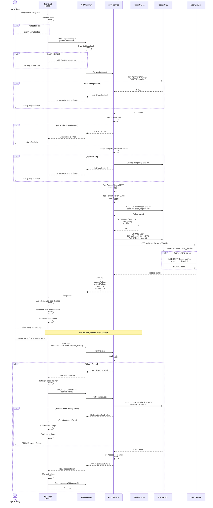

# Sequence Diagram - Đăng nhập

> Quy trình đăng nhập với JWT authentication



## Ghi chú

### Luồng chính:

1. **Người dùng nhập thông tin**: Email + Password
2. **Frontend validation**: Kiểm tra định dạng trước khi gửi
3. **API Gateway**: Rate limiting (tối đa 5 requests/phút)
4. **Auth Service kiểm tra**:
   - User tồn tại trong DB
   - Tài khoản đang active
   - Mật khẩu đúng (bcrypt compare)
5. **Tạo tokens**:
   - **Access Token**: JWT, exp 15 phút, chứa {user_id, email, role}
   - **Refresh Token**: JWT, exp 7 ngày, lưu vào DB
6. **Lưu session**: Redis cache (15 phút)
7. **Lấy profile**: Từ User Service (tạo mới nếu chưa có)
8. **Trả về**: Tokens + user data + profile
9. **Frontend lưu**: localStorage + Zustand store
10. **Redirect**: Dashboard

### Xử lý token hết hạn:

**Khi Access Token hết hạn (sau 15 phút)**:
1. API trả về 401
2. Frontend tự động gọi `/auth/refresh` với Refresh Token
3. Nhận Access Token mới
4. Retry request ban đầu

**Nếu Refresh Token cũng hết hạn (sau 7 ngày)**:
- Yêu cầu đăng nhập lại
- Clear localStorage
- Redirect to /login

### Bảo mật:

- **Password**: Bcrypt hash với salt 10 rounds
- **JWT**: Signed với secret key
- **Rate Limiting**: 5 login attempts/phút
- **Session**: Redis cache với TTL 15 phút
- **Refresh Token**: Lưu DB, có thể revoke

### Redis Session:
```json
{
  "user_id": "uuid",
  "email": "user@example.com",
  "role": "co_owner",
  "is_verified": true,
  "last_activity": "2025-01-20T10:30:00Z"
}
```

### Response thành công:
```json
{
  "accessToken": "eyJhbGc...",
  "refreshToken": "eyJhbGc...",
  "user": {
    "id": "uuid",
    "email": "user@example.com",
    "role": "co_owner",
    "isVerified": true,
    "isActive": true
  },
  "profile": {
    "full_name": "Nguyễn Văn A",
    "phone": "0123456789",
    "avatar": "https://..."
  }
}
```

### Xử lý lỗi:

- **401**: Email/password sai hoặc token hết hạn
- **403**: Tài khoản bị khóa
- **429**: Quá nhiều requests
- **500**: Lỗi server
