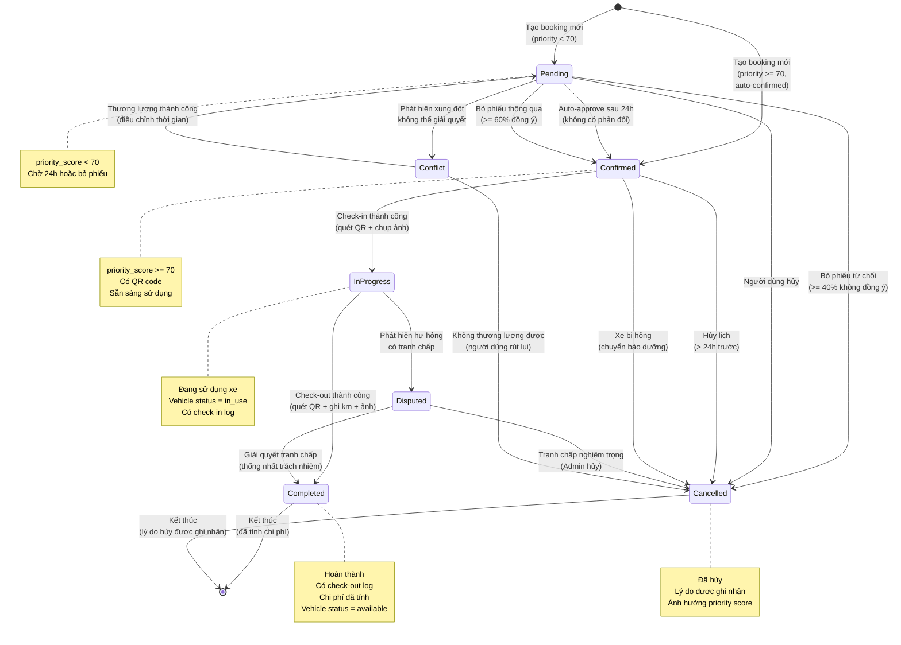

# State Machine Diagram - Trạng thái Booking

> Các trạng thái và chuyển đổi của lịch đặt xe

## Ghi chú

### Trạng thái:

1. **pending** (Chờ phê duyệt)
   - Điều kiện: priority_score < 70
   - Chờ 24h để auto-approve
   - Hoặc bỏ phiếu

2. **confirmed** (Đã xác nhận)
   - Điều kiện: priority_score >= 70 hoặc đã được phê duyệt
   - Có QR code
   - Sẵn sàng check-in

3. **in_progress** (Đang sử dụng)
   - Đã check-in
   - Vehicle status = `in_use`
   - Người dùng đang sử dụng xe

4. **completed** (Hoàn thành)
   - Đã check-out
   - Chi phí đã tính
   - Vehicle status = `available`

5. **cancelled** (Đã hủy)
   - Người dùng hủy hoặc bị từ chối
   - Lý do được ghi nhận
   - Ảnh hưởng đến reliability_score

6. **conflict** (Xung đột)
   - Có xung đột với booking khác
   - Chờ thương lượng

7. **disputed** (Tranh chấp)
   - Phát hiện hư hỏng khi check-out
   - Chờ giải quyết trách nhiệm

### Chuyển đổi:

| Từ | Đến | Điều kiện | Hành động |
|---|---|---|---|
| - | pending | Tạo mới, priority < 70 | Thông báo nhóm |
| - | confirmed | Tạo mới, priority >= 70 | Tạo QR |
| pending | confirmed | 24h không phản đối | Tạo QR, thông báo |
| pending | confirmed | Bỏ phiếu >= 60% | Tạo QR |
| pending | cancelled | Bỏ phiếu >= 40% từ chối | Ghi lý do |
| pending | cancelled | Người dùng hủy | Ghi lý do |
| confirmed | in_progress | Check-in | Cập nhật vehicle |
| confirmed | cancelled | Hủy (>24h trước) | Ghi lý do |
| in_progress | completed | Check-out | Tính chi phí |
| in_progress | disputed | Phát hiện hư hỏng | Mở dispute |
| disputed | completed | Giải quyết | Gán trách nhiệm |
| completed | - | - | Kết thúc |
| cancelled | - | - | Kết thúc |

### Ràng buộc:

- **Hủy booking**: Chỉ được hủy nếu > 24h trước thời gian bắt đầu
- **Check-in**: Chỉ được check-in trong khoảng -15 phút đến +30 phút
- **Check-out**: Phải có check-in trước đó
- **Tranh chấp**: Chỉ phát sinh khi có hư hỏng mới sau sử dụng
