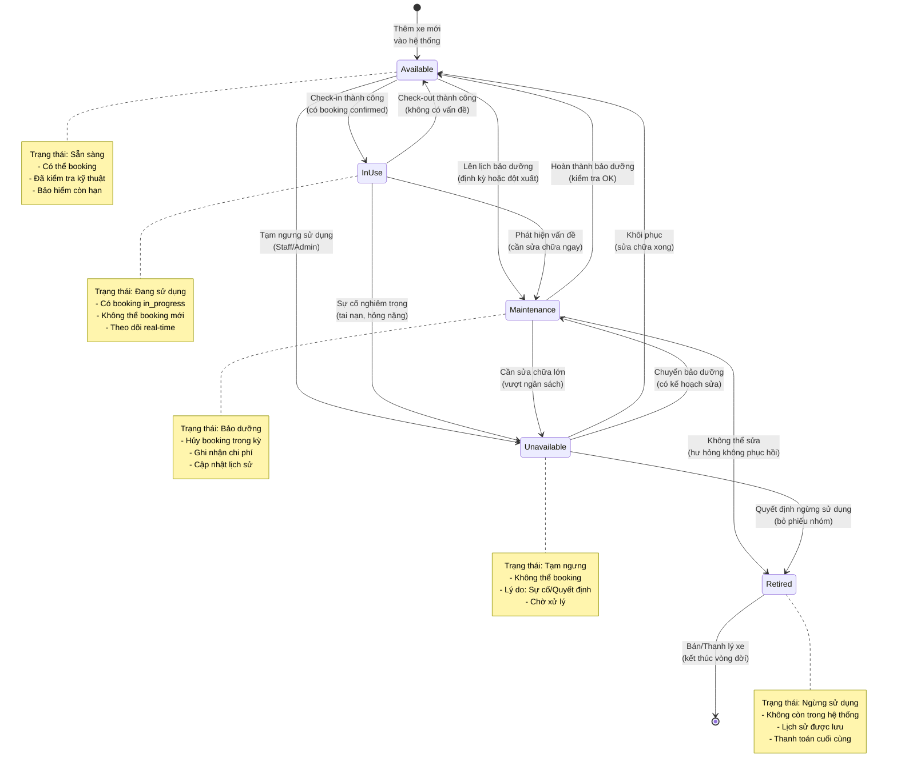

# State Machine Diagram - Trạng thái Xe

> Các trạng thái và chuyển đổi của xe trong hệ thống

## Ghi chú

### Trạng thái:

1. **available** (Sẵn sàng)
   - Xe có thể được đặt lịch
   - Đã qua kiểm tra kỹ thuật
   - Bảo hiểm còn hiệu lực
   - Không có vấn đề kỹ thuật

2. **in_use** (Đang sử dụng)
   - Có booking đang ở trạng thái `in_progress`
   - Không thể booking mới
   - Theo dõi vị trí (nếu có GPS)
   - Người dùng đang sử dụng

3. **maintenance** (Bảo dưỡng)
   - Đang trong quá trình bảo dưỡng/sửa chữa
   - Tất cả booking trong kỳ bị hủy
   - Ghi nhận chi phí bảo dưỡng
   - Cập nhật lịch sử bảo dưỡng

4. **unavailable** (Tạm ngưng)
   - Tạm thời không sử dụng được
   - Lý do: Sự cố, quyết định nhóm, chờ sửa chữa
   - Không thể booking
   - Chờ xử lý

5. **retired** (Ngừng sử dụng)
   - Xe ngừng hoạt động vĩnh viễn
   - Lý do: Bán, thanh lý, hỏng không sửa được
   - Lịch sử được lưu trữ
   - Thanh toán cuối cùng cho thành viên

### Chuyển đổi:

| Từ | Đến | Kích hoạt | Người thực hiện |
|---|---|---|---|
| - | available | Thêm xe mới | Staff/Admin |
| available | in_use | Check-in | Co-owner |
| available | maintenance | Lên lịch bảo dưỡng | Staff |
| available | unavailable | Tạm ngưng | Staff/Admin |
| in_use | available | Check-out OK | Co-owner |
| in_use | maintenance | Phát hiện vấn đề | Staff |
| in_use | unavailable | Sự cố nghiêm trọng | Staff/Admin |
| maintenance | available | Hoàn thành | Staff |
| maintenance | unavailable | Cần sửa lớn | Staff |
| maintenance | retired | Không sửa được | Admin |
| unavailable | available | Khôi phục | Staff |
| unavailable | maintenance | Chuyển sửa | Staff |
| unavailable | retired | Quyết định ngừng | Admin + Bỏ phiếu |
| retired | - | Thanh lý | Admin |

### Ràng buộc:

**Chuyển sang maintenance**:
- Hủy tất cả booking trong thời gian bảo dưỡng
- Thông báo cho người dùng có booking
- Gợi ý xe thay thế (nếu có)

**Chuyển sang unavailable**:
- Ghi rõ lý do
- Ước tính thời gian khôi phục
- Thông báo nhóm

**Chuyển sang retired**:
- Cần bỏ phiếu nhóm (nếu bán)
- Thanh toán cuối cùng theo ownership
- Lưu trữ lịch sử đầy đủ

### Điều kiện kiểm tra:

**Trước khi available**:
- [ ] Kiểm tra kỹ thuật OK
- [ ] Bảo hiểm còn hiệu lực >= 30 ngày
- [ ] Đăng kiểm còn hạn
- [ ] Không có cảnh báo kỹ thuật

**Trong maintenance**:
- Ghi nhận: Ngày bắt đầu, dự kiến hoàn thành, chi phí
- Cập nhật: Tiến độ, vấn đề phát hiện thêm
- Hoàn thành: Kiểm tra lại toàn bộ trước khi available

### Events phát sinh:

- `VEHICLE_STATUS_CHANGED`: Mỗi khi status thay đổi
- `VEHICLE_AVAILABLE`: Xe sẵn sàng sử dụng
- `VEHICLE_MAINTENANCE_SCHEDULED`: Lên lịch bảo dưỡng
- `VEHICLE_UNAVAILABLE`: Xe không khả dụng
- `VEHICLE_RETIRED`: Xe ngừng sử dụng
