# Use Case Diagram - Đồng sở hữu (Co-owner)

> Sơ đồ Use Case chi tiết cho người dùng Đồng sở hữu xe

```mermaid
graph TB
    Actor((Đồng sở hữu<br/>Co-owner))
    
    subgraph "UC1: Quản lý Tài khoản & Hồ sơ"
        UC1_1[Đăng ký tài khoản]
        UC1_2[Đăng nhập/Đăng xuất]
        UC1_3[Xác minh email]
        UC1_4[Cập nhật hồ sơ]
        UC1_5[Xác thực KYC]
        UC1_5a[Upload CCCD/GPLX]
        UC1_5b[Xác nhận khuôn mặt]
        UC1_6[Quản lý mật khẩu]
    end
    
    subgraph "UC2: Quản lý Nhóm Đồng sở hữu"
        UC2_1[Tạo nhóm mới]
        UC2_2[Mời thành viên]
        UC2_3[Chấp nhận/Từ chối lời mời]
        UC2_4[Xem danh sách thành viên]
        UC2_5[Cập nhật tỷ lệ sở hữu]
        UC2_6[Rời khỏi nhóm]
        UC2_7[Xóa thành viên]
    end
    
    subgraph "UC3: Quỹ Chung Nhóm"
        UC3_1[Nạp tiền vào quỹ]
        UC3_2[Rút tiền từ quỹ]
        UC3_3[Xem số dư quỹ]
        UC3_4[Xem lịch sử giao dịch]
        UC3_5[Phân bổ chi phí từ quỹ]
    end
    
    subgraph "UC4: Bỏ phiếu Nhóm"
        UC4_1[Tạo đề xuất bỏ phiếu]
        UC4_2[Bỏ phiếu]
        UC4_3[Xem kết quả]
        UC4_4[Đóng bỏ phiếu]
    end
    
    subgraph "UC5: Đặt lịch Sử dụng Xe"
        UC5_1[Xem lịch xe]
        UC5_2[Tạo lịch đặt mới]
        UC5_3[Chỉnh sửa lịch đặt]
        UC5_4[Hủy lịch đặt]
        UC5_5[Xem lịch đặt của tôi]
        UC5_6[Xem lịch đặt nhóm]
        UC5_7[Xử lý xung đột lịch]
    end
    
    subgraph "UC6: Check-in/Check-out"
        UC6_1[Quét mã QR check-in]
        UC6_2[Chụp ảnh trước khi sử dụng]
        UC6_3[Ghi nhận số km ban đầu]
        UC6_4[Quét mã QR check-out]
        UC6_5[Chụp ảnh sau khi sử dụng]
        UC6_6[Ghi nhận số km cuối]
        UC6_7[Xác nhận điện năng tiêu thụ]
    end
    
    subgraph "UC7: Quản lý Chi phí"
        UC7_1[Xem chi phí cá nhân]
        UC7_2[Xem chi phí nhóm]
        UC7_3[Ghi nhận chi phí mới]
        UC7_4[Xem chi phí được chia]
        UC7_5[Thanh toán chi phí]
        UC7_6[Xem lịch sử thanh toán]
        UC7_7[Tải báo cáo chi phí]
    end
    
    subgraph "UC8: Ví Điện tử"
        UC8_1[Nạp tiền vào ví]
        UC8_2[Rút tiền từ ví]
        UC8_3[Xem số dư ví]
        UC8_4[Xem lịch sử giao dịch ví]
        UC8_5[Liên kết thẻ ngân hàng]
    end
    
    subgraph "UC9: Hợp đồng Đồng sở hữu"
        UC9_1[Xem hợp đồng]
        UC9_2[Ký số hợp đồng]
        UC9_3[Tải xuống PDF]
        UC9_4[Xem lịch sử ký]
    end
    
    subgraph "UC10: Tranh chấp & Khiếu nại"
        UC10_1[Gửi khiếu nại mới]
        UC10_2[Xem trạng thái khiếu nại]
        UC10_3[Trả lời tin nhắn]
        UC10_4[Upload bằng chứng]
        UC10_5[Đóng khiếu nại]
    end
    
    subgraph "UC11: AI & Phân tích"
        UC11_1[Xem đề xuất lịch công bằng]
        UC11_2[Xem phân tích sử dụng]
        UC11_3[Xem dự đoán chi phí]
        UC11_4[So sánh mức sử dụng/sở hữu]
    end
    
    subgraph "UC12: Thông báo"
        UC12_1[Xem thông báo]
        UC12_2[Đánh dấu đã đọc]
        UC12_3[Cài đặt thông báo]
        UC12_4[Nhận push notification]
    end
    
    Actor --> UC1_1
    Actor --> UC1_2
    Actor --> UC1_4
    Actor --> UC1_5
    Actor --> UC1_6
    Actor --> UC2_1
    Actor --> UC2_2
    Actor --> UC2_3
    Actor --> UC2_4
    Actor --> UC2_5
    Actor --> UC2_6
    Actor --> UC2_7
    Actor --> UC3_1
    Actor --> UC3_2
    Actor --> UC3_3
    Actor --> UC3_4
    Actor --> UC4_1
    Actor --> UC4_2
    Actor --> UC4_3
    Actor --> UC5_1
    Actor --> UC5_2
    Actor --> UC5_3
    Actor --> UC5_4
    Actor --> UC5_5
    Actor --> UC5_6
    Actor --> UC6_1
    Actor --> UC6_4
    Actor --> UC7_1
    Actor --> UC7_2
    Actor --> UC7_3
    Actor --> UC7_5
    Actor --> UC7_6
    Actor --> UC7_7
    Actor --> UC8_1
    Actor --> UC8_3
    Actor --> UC8_4
    Actor --> UC9_1
    Actor --> UC9_2
    Actor --> UC9_3
    Actor --> UC10_1
    Actor --> UC10_2
    Actor --> UC10_3
    Actor --> UC11_1
    Actor --> UC11_2
    Actor --> UC11_3
    Actor --> UC12_1
    Actor --> UC12_2
    Actor --> UC12_3
    
    UC1_5 -.include.-> UC1_5a
    UC1_5 -.include.-> UC1_5b
    UC1_1 -.extend.-> UC1_3
    UC5_2 -.extend.-> UC5_7
    UC6_1 -.include.-> UC6_2
    UC6_1 -.include.-> UC6_3
    UC6_4 -.include.-> UC6_5
    UC6_4 -.include.-> UC6_6
    UC6_4 -.include.-> UC6_7
    UC7_5 -.include.-> UC8_1
    
    style Actor fill:#4A90E2,stroke:#2E5C8A,stroke-width:3px,color:#fff
```

## Ghi chú

### Nhóm chức năng chính:
1. **Quản lý Tài khoản**: Đăng ký, xác thực KYC (CCCD/GPLX), cập nhật hồ sơ
2. **Quản lý Nhóm**: Tạo nhóm, mời/xóa thành viên, quản lý tỷ lệ sở hữu
3. **Quỹ Chung**: Nạp/rút tiền, xem số dư, phân bổ chi phí
4. **Bỏ phiếu**: Tạo đề xuất, bỏ phiếu, xem kết quả theo tỷ lệ sở hữu
5. **Đặt lịch**: Xem lịch chung, đặt/sửa/hủy lịch, xử lý xung đột
6. **Check-in/out**: Quét QR, chụp ảnh, ghi nhận km & điện năng
7. **Chi phí**: Xem chi phí được chia, thanh toán, báo cáo
8. **Ví điện tử**: Nạp/rút tiền, liên kết ngân hàng
9. **Hợp đồng**: Xem, ký số, tải PDF
10. **Tranh chấp**: Gửi khiếu nại, upload bằng chứng
11. **AI**: Đề xuất lịch công bằng, phân tích sử dụng, dự đoán chi phí
12. **Thông báo**: Nhận và quản lý thông báo

### Quan hệ:
- **include**: Chức năng bắt buộc (KYC upload, QR scan + photo)
- **extend**: Chức năng tùy chọn (email verification, conflict resolution)
