# Use Case Diagram - Tổng quan hệ thống

> Sơ đồ Use Case tổng quan cho hệ thống đồng sở hữu và chia sẻ chi phí xe điện

```mermaid
graph TB
    subgraph "Hệ thống EV Co-ownership"
        
        subgraph "Quản lý tài khoản"
            UC1[Đăng ký tài khoản]
            UC2[Đăng nhập]
            UC3[Quản lý hồ sơ cá nhân]
            UC4[Xác thực danh tính KYC]
        end
        
        subgraph "Quản lý nhóm & Quyền sở hữu"
            UC5[Tạo nhóm đồng sở hữu]
            UC6[Thêm/Xóa thành viên]
            UC7[Quản lý tỷ lệ sở hữu]
            UC8[Bỏ phiếu nhóm]
            UC9[Quản lý quỹ chung]
        end
        
        subgraph "Đặt lịch & Sử dụng xe"
            UC10[Xem lịch xe]
            UC11[Đặt lịch sử dụng xe]
            UC12[Sửa/Hủy lịch đặt]
            UC13[Check-in bằng QR]
            UC14[Check-out bằng QR]
        end
        
        subgraph "Quản lý xe & Bảo dưỡng"
            UC15[Thêm thông tin xe]
            UC16[Cập nhật trạng thái xe]
            UC17[Lên lịch bảo dưỡng]
            UC18[Theo dõi bảo hiểm]
            UC19[Ghi nhận phiên sạc điện]
        end
        
        subgraph "Chi phí & Thanh toán"
            UC20[Ghi nhận chi phí]
            UC21[Tự động chia sẻ chi phí]
            UC22[Thanh toán trực tuyến]
            UC23[Xem báo cáo chi phí]
            UC24[Quản lý ví điện tử]
        end
        
        subgraph "Hợp đồng điện tử"
            UC25[Tạo hợp đồng đồng sở hữu]
            UC26[Ký số hợp đồng]
            UC27[Xem lịch sử hợp đồng]
        end
        
        subgraph "Tranh chấp & Hỗ trợ"
            UC28[Gửi khiếu nại tranh chấp]
            UC29[Xử lý tranh chấp]
            UC30[Gửi thông báo]
        end
        
        subgraph "AI & Phân tích"
            UC31[Đề xuất lịch công bằng]
            UC32[Phân tích sử dụng xe]
            UC33[Dự đoán chi phí]
        end
        
        subgraph "Quản trị hệ thống"
            UC34[Duyệt KYC]
            UC35[Xem audit log]
            UC36[Quản lý cài đặt hệ thống]
            UC37[Xem dashboard analytics]
        end
    end
    
    Actor1((Đồng sở hữu<br/>Co-owner))
    Actor2((Nhân viên<br/>Staff))
    Actor3((Quản trị<br/>Admin))
    
    Actor1 --> UC1
    Actor1 --> UC2
    Actor1 --> UC3
    Actor1 --> UC4
    Actor1 --> UC5
    Actor1 --> UC6
    Actor1 --> UC7
    Actor1 --> UC8
    Actor1 --> UC9
    Actor1 --> UC10
    Actor1 --> UC11
    Actor1 --> UC12
    Actor1 --> UC13
    Actor1 --> UC14
    Actor1 --> UC20
    Actor1 --> UC22
    Actor1 --> UC23
    Actor1 --> UC24
    Actor1 --> UC25
    Actor1 --> UC26
    Actor1 --> UC27
    Actor1 --> UC28
    Actor1 --> UC31
    Actor1 --> UC32
    
    Actor2 --> UC2
    Actor2 --> UC13
    Actor2 --> UC14
    Actor2 --> UC15
    Actor2 --> UC16
    Actor2 --> UC17
    Actor2 --> UC18
    Actor2 --> UC19
    Actor2 --> UC29
    Actor2 --> UC30
    Actor2 --> UC34
    
    Actor3 --> UC2
    Actor3 --> UC29
    Actor3 --> UC30
    Actor3 --> UC34
    Actor3 --> UC35
    Actor3 --> UC36
    Actor3 --> UC37

    style Actor1 fill:#4A90E2,stroke:#2E5C8A,stroke-width:3px,color:#fff
    style Actor2 fill:#50C878,stroke:#2E7D4E,stroke-width:3px,color:#fff
    style Actor3 fill:#E94B3C,stroke:#A13429,stroke-width:3px,color:#fff
```

## Ghi chú

### Actors (Diễn viên)
- **Đồng sở hữu (Co-owner)**: Người dùng chính của hệ thống, có quyền sở hữu xe và sử dụng đầy đủ các chức năng
- **Nhân viên (Staff)**: Quản lý xe, check-in/out, duyệt KYC, xử lý tranh chấp
- **Quản trị (Admin)**: Quản lý toàn hệ thống, xem báo cáo, audit log, cài đặt

### Nhóm Use Case
1. **Quản lý tài khoản**: Đăng ký, đăng nhập, xác thực KYC
2. **Quản lý nhóm**: Tạo nhóm, thêm thành viên, bỏ phiếu, quỹ chung
3. **Đặt lịch**: Xem lịch, đặt/sửa/hủy lịch, check-in/out QR
4. **Quản lý xe**: Thông tin xe, bảo dưỡng, bảo hiểm, sạc điện
5. **Chi phí**: Ghi nhận, chia sẻ, thanh toán, báo cáo
6. **Hợp đồng**: Tạo, ký số, xem lịch sử
7. **Tranh chấp**: Gửi khiếu nại, xử lý, thông báo
8. **AI**: Đề xuất lịch, phân tích, dự đoán
9. **Quản trị**: KYC, audit, analytics, cài đặt
