# Use Case Diagram - Nhân viên & Quản trị (Staff & Admin)

> Sơ đồ Use Case chi tiết cho Nhân viên vận hành và Quản trị viên

```mermaid
graph TB
    Actor1((Nhân viên<br/>Staff))
    Actor2((Quản trị<br/>Admin))
    
    subgraph "UC1: Quản lý Xe"
        UC1_1[Thêm xe mới]
        UC1_2[Cập nhật thông tin xe]
        UC1_3[Thay đổi trạng thái xe]
        UC1_4[Xóa xe]
        UC1_5[Upload ảnh xe]
        UC1_6[Cập nhật số km hiện tại]
        UC1_7[Xem lịch sử sử dụng xe]
    end
    
    subgraph "UC2: Bảo dưỡng Xe"
        UC2_1[Lên lịch bảo dưỡng]
        UC2_2[Cập nhật lịch bảo dưỡng]
        UC2_3[Hoàn thành bảo dưỡng]
        UC2_4[Hủy lịch bảo dưỡng]
        UC2_5[Xem lịch sử bảo dưỡng]
        UC2_6[Ghi nhận chi phí bảo dưỡng]
        UC2_7[Nhắc nhở bảo dưỡng định kỳ]
    end
    
    subgraph "UC3: Bảo hiểm Xe"
        UC3_1[Thêm bảo hiểm]
        UC3_2[Cập nhật bảo hiểm]
        UC3_3[Xem thông tin bảo hiểm]
        UC3_4[Nhận cảnh báo hết hạn]
        UC3_5[Gia hạn bảo hiểm]
    end
    
    subgraph "UC4: Sạc điện"
        UC4_1[Ghi nhận phiên sạc]
        UC4_2[Cập nhật chi phí sạc]
        UC4_3[Xem lịch sử sạc]
        UC4_4[Kiểm tra sức khỏe pin]
    end
    
    subgraph "UC5: Check-in/Check-out"
        UC5_1[Tạo mã QR check-in]
        UC5_2[Xác nhận check-in]
        UC5_3[Tạo mã QR check-out]
        UC5_4[Xác nhận check-out]
        UC5_5[Xem ảnh trước/sau]
        UC5_6[Xác minh tình trạng xe]
    end
    
    subgraph "UC6: Xác thực KYC"
        UC6_1[Xem yêu cầu KYC]
        UC6_2[Kiểm tra tài liệu]
        UC6_3[Phê duyệt KYC]
        UC6_4[Từ chối KYC]
        UC6_5[Yêu cầu bổ sung tài liệu]
    end
    
    subgraph "UC7: Xử lý Tranh chấp"
        UC7_1[Xem danh sách tranh chấp]
        UC7_2[Nhận tranh chấp mới]
        UC7_3[Điều tra tranh chấp]
        UC7_4[Trả lời tin nhắn]
        UC7_5[Xem bằng chứng]
        UC7_6[Giải quyết tranh chấp]
        UC7_7[Đóng tranh chấp]
        UC7_8[Gửi thông báo quyết định]
    end
    
    subgraph "UC8: Quản lý Thông báo"
        UC8_1[Tạo thông báo thủ công]
        UC8_2[Gửi thông báo cho nhóm]
        UC8_3[Gửi thông báo cho người dùng]
        UC8_4[Xem lịch sử thông báo]
        UC8_5[Quản lý mẫu thông báo]
    end
    
    subgraph "UC9: Dashboard & Analytics (Admin)"
        UC9_1[Xem tổng quan hệ thống]
        UC9_2[Thống kê người dùng]
        UC9_3[Thống kê nhóm]
        UC9_4[Thống kê booking]
        UC9_5[Thống kê doanh thu]
        UC9_6[Thống kê xe]
        UC9_7[Phân tích xu hướng]
        UC9_8[Xuất báo cáo]
    end
    
    subgraph "UC10: Audit Log (Admin)"
        UC10_1[Xem audit log]
        UC10_2[Lọc theo người dùng]
        UC10_3[Lọc theo hành động]
        UC10_4[Lọc theo thời gian]
        UC10_5[Xuất log]
    end
    
    subgraph "UC11: Quản lý Người dùng (Admin)"
        UC11_1[Xem danh sách người dùng]
        UC11_2[Tìm kiếm người dùng]
        UC11_3[Kích hoạt/Vô hiệu hóa tài khoản]
        UC11_4[Reset mật khẩu]
        UC11_5[Thay đổi vai trò]
        UC11_6[Xem lịch sử hoạt động]
    end
    
    subgraph "UC12: Cài đặt Hệ thống (Admin)"
        UC12_1[Quản lý cấu hình]
        UC12_2[Cài đặt phí dịch vụ]
        UC12_3[Cài đặt thuật toán ưu tiên]
        UC12_4[Quản lý API keys]
        UC12_5[Cấu hình email]
        UC12_6[Cấu hình thanh toán]
        UC12_7[Backup/Restore]
    end
    
    %% Staff connections
    Actor1 --> UC1_1
    Actor1 --> UC1_2
    Actor1 --> UC1_3
    Actor1 --> UC1_5
    Actor1 --> UC1_6
    Actor1 --> UC1_7
    Actor1 --> UC2_1
    Actor1 --> UC2_2
    Actor1 --> UC2_3
    Actor1 --> UC2_4
    Actor1 --> UC2_5
    Actor1 --> UC2_6
    Actor1 --> UC3_1
    Actor1 --> UC3_2
    Actor1 --> UC3_3
    Actor1 --> UC3_5
    Actor1 --> UC4_1
    Actor1 --> UC4_2
    Actor1 --> UC4_3
    Actor1 --> UC5_1
    Actor1 --> UC5_2
    Actor1 --> UC5_3
    Actor1 --> UC5_4
    Actor1 --> UC5_5
    Actor1 --> UC5_6
    Actor1 --> UC6_1
    Actor1 --> UC6_2
    Actor1 --> UC6_3
    Actor1 --> UC6_4
    Actor1 --> UC6_5
    Actor1 --> UC7_1
    Actor1 --> UC7_2
    Actor1 --> UC7_3
    Actor1 --> UC7_4
    Actor1 --> UC7_5
    Actor1 --> UC7_6
    Actor1 --> UC7_7
    Actor1 --> UC8_1
    Actor1 --> UC8_2
    Actor1 --> UC8_3
    Actor1 --> UC8_4
    
    %% Admin connections (includes all Staff + more)
    Actor2 --> UC1_4
    Actor2 --> UC7_1
    Actor2 --> UC7_6
    Actor2 --> UC7_7
    Actor2 --> UC8_5
    Actor2 --> UC9_1
    Actor2 --> UC9_2
    Actor2 --> UC9_3
    Actor2 --> UC9_4
    Actor2 --> UC9_5
    Actor2 --> UC9_6
    Actor2 --> UC9_7
    Actor2 --> UC9_8
    Actor2 --> UC10_1
    Actor2 --> UC10_2
    Actor2 --> UC10_3
    Actor2 --> UC10_4
    Actor2 --> UC10_5
    Actor2 --> UC11_1
    Actor2 --> UC11_2
    Actor2 --> UC11_3
    Actor2 --> UC11_4
    Actor2 --> UC11_5
    Actor2 --> UC11_6
    Actor2 --> UC12_1
    Actor2 --> UC12_2
    Actor2 --> UC12_3
    Actor2 --> UC12_4
    Actor2 --> UC12_5
    Actor2 --> UC12_6
    Actor2 --> UC12_7
    
    %% Relationships
    UC5_1 -.include.-> UC5_2
    UC5_3 -.include.-> UC5_4
    UC6_3 -.extend.-> UC8_3
    UC6_4 -.extend.-> UC6_5
    UC7_6 -.include.-> UC7_8
    UC2_3 -.include.-> UC2_6
    UC3_4 -.extend.-> UC3_5
    
    style Actor1 fill:#50C878,stroke:#2E7D4E,stroke-width:3px,color:#fff
    style Actor2 fill:#E94B3C,stroke:#A13429,stroke-width:3px,color:#fff
```

## Ghi chú

### Nhân viên (Staff)
Nhân viên có quyền quản lý vận hành hàng ngày:

1. **Quản lý Xe**: Thêm, cập nhật, thay đổi trạng thái xe
2. **Bảo dưỡng**: Lên lịch, hoàn thành, ghi nhận chi phí
3. **Bảo hiểm**: Quản lý thông tin, gia hạn
4. **Sạc điện**: Ghi nhận phiên sạc, chi phí
5. **Check-in/out**: Tạo QR, xác nhận, kiểm tra tình trạng xe
6. **KYC**: Xem, kiểm tra, phê duyệt/từ chối
7. **Tranh chấp**: Nhận, điều tra, giải quyết
8. **Thông báo**: Tạo và gửi thông báo

### Quản trị viên (Admin)
Admin có toàn quyền + các chức năng đặc biệt:

1. **Tất cả quyền Staff** (kế thừa)
2. **Dashboard**: Thống kê tổng quan, phân tích xu hướng
3. **Audit Log**: Xem, lọc, xuất log hệ thống
4. **Quản lý Người dùng**: Kích hoạt/vô hiệu hóa, reset password, thay đổi role
5. **Cài đặt Hệ thống**: Cấu hình, phí, thuật toán, API keys, backup/restore
6. **Xóa dữ liệu**: Quyền xóa xe, tranh chấp...

### Quan hệ:
- **include**: Chức năng bắt buộc (QR → xác nhận, giải quyết → thông báo)
- **extend**: Chức năng tùy chọn (KYC từ chối → yêu cầu bổ sung)
- **generalization**: Admin kế thừa quyền Staff
